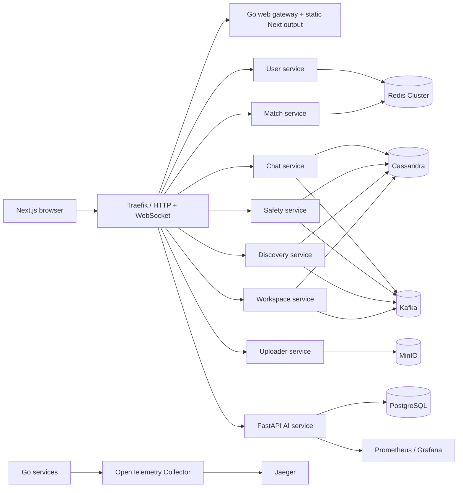
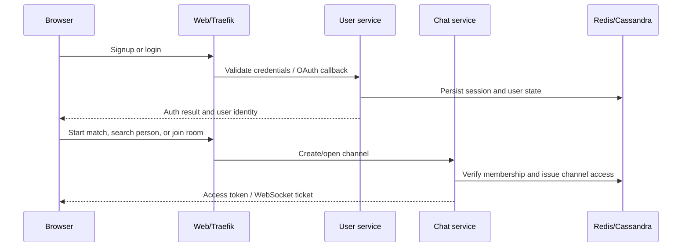
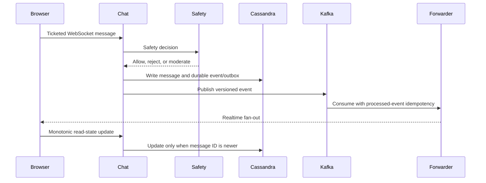

# NexusChat Project Reference

This is the maintained English reference for the complete NexusChat platform. It describes the business boundaries, runtime services, APIs, data ownership, workflows, technology choices, deployment model, and known limitations. Generated Swagger files remain the contract for the HTTP APIs; this document explains how those contracts fit together.

## Product scope

NexusChat is a real-time social chat platform. A user can create an account, sign in with a password or Google OAuth, discover people, send a friend request, start a direct conversation after acceptance, be matched with a waiting user, join or create group rooms, exchange text and files, edit/delete/react to/pin/reply to messages, search history, manage avatars, and use AI-assisted draft rewriting. Trust & Safety supports blocking and reporting. Workspace provides channel-scoped tasks, bookmarks, collections, checklists, and reminders.

The platform is intentionally split into a Go business-services runtime, a Next.js browser client, and an independent Python AI service. Cassandra is the durable chat/business store; Redis is used for low-latency coordination and caching; Kafka carries versioned domain events; PostgreSQL belongs to AI state; MinIO stores uploaded objects.

## Architecture overview



## Services and responsibilities

| Runtime | Binary / container | Business responsibility | Durable state and dependencies |
|---|---|---|---|
| Web | `server web` / `nexuschat-web` | Serves the exported Next.js application and HTTP/WebSocket gateway routes. | Stateless; Traefik, chat/user services |
| User | `server user` / `nexuschat-api` | Signup, login, sessions, Google OAuth, public profiles, friendship lifecycle, notifications. | Redis sessions; Cassandra user/friend/notification tables |
| Chat | `server chat` / `nexuschat-api` | Direct/group/random channels, messages, read state, reactions, pins, edits, deletes, rooms, authorization. | Cassandra messages/channels; Redis session/cache; Kafka; Safety gRPC |
| Match | `server match` / `nexuschat-api` | Waiting queue and random matching with safety/discovery filters. | Redis waitlist and locks; Chat/Safety/Discovery gRPC |
| Uploader | `server uploader` / `nexuschat-api` | Authenticated multipart/chunked upload and download URLs. | MinIO object storage; chat forward-auth |
| Forwarder | `server forwarder` / `nexuschat-api` | Kafka-to-realtime fan-out and routing. | Redis routing state; Kafka |
| Safety | `server safety` / `nexuschat-safety` | Reports, blocks, rules, risk decisions and moderation events. | Cassandra decisions/reports/rules; Redis rate/risk/block cache |
| Discovery | `server discovery` / `nexuschat-discovery` | Interest profiles, match ranking, feedback. | Cassandra profiles/matches/feedback; Redis cache |
| Workspace | `server workspace` / `nexuschat-workspace` | Channel-scoped tasks, notes/bookmarks, boards, collections, checklists, reminders. | Cassandra workspace tables; Redis leases/cache; Chat authorization |
| AI service | `uvicorn app.main:app` / `nexuschat-ai-service` | Provider-neutral rewrite, streaming, agents, MCP preview and AI persistence. | PostgreSQL/Alembic; optional Redis; provider HTTP API |

Go services share configuration, observability, Cassandra/Redis/Kafka clients, identity middleware, durable event publishing, and gRPC transport. The Python service does not write chat Cassandra tables directly.

## User-facing features

### Identity and account

- Password signup and login with server-side validation and secure session cookies/tokens.
- Google OAuth callback flow with state validation.
- Profile display name, handle, avatar, and public numeric ID.
- Friendship states: none, outgoing pending, incoming pending, accepted, declined.
- Durable in-app notifications with deterministic IDs and a dedicated Cassandra outbox/retry worker. Legacy per-message read flags are removed; read-state correctness uses the durable read-state table and monotonic updates.

### Conversations

- Random matching through the match WebSocket.
- Direct chat after friendship acceptance.
- Group room creation, invite-code join, room listing, owner role, member roles, and owner-controlled avatar.
- Message text/file events, pagination, offline cache, draft persistence, typing and presence events.
- Edit, delete-for-all, reply preview, emoji reaction, pin, delivery and read state.
- Search and media gallery.

### Trust, safety, and productivity

- Report a peer with reason/details.
- Block a peer and enforce the block during matching/chat flows.
- Safety rules and risk decisions are emitted as versioned events.
- Workspace items are authorized against the authenticated channel identity; cross-channel requests return `403`.
- Tasks/bookmarks/collections/checklists/reminders are persisted and broadcast through the workspace event stream.

### AI assistance

- Non-streaming and SSE assistant rewrite.
- OpenAI-compatible provider adapter configured by environment variables.
- Agent CRUD and MCP tool listing/preview.
- AI PostgreSQL migrations are applied by the AI container before startup.
- Provider side effects are preview-first; MCP execution approval and complete agent lifecycle remain roadmap work.

## HTTP and WebSocket API map

The Go Swagger packages under `docs/user`, `docs/chat`, `docs/match`, and `docs/uploader` are generated from source annotations. Regenerate them with `make doc` after changing annotations.

| Area | Main endpoints | Authentication |
|---|---|---|
| User | `POST /api/user/signup`, `POST /api/user/login`, `GET /api/user/me`, Google OAuth routes, profile routes, friendship request/status routes, notifications routes | Public for signup/login/OAuth; authenticated for account data |
| Chat | `GET /api/chat/health`, channel/message REST routes, room/invite routes, `GET /api/chat/ws` or the ticketed chat WebSocket, AI rewrite proxy | Authenticated session/ticket; channel identity is checked server-side |
| Match | `GET /api/match/health`, matching WebSocket | Authenticated user identity |
| Uploader | Upload, chunk upload, complete, download routes under `/api/uploader` | Authenticated user and channel authorization |
| Safety | `GET/POST /api/safety/reports`, report status/appeal routes, block routes, rules and health | Authenticated; reporter and target fields are validated |
| Discovery | Profile, feedback, match and health routes under `/api/discovery` | Authenticated user identity |
| Workspace | `/api/workspace/items`, status/assignee/checklist routes, `GET /api/workspace/boards/{channelId}`, `GET /api/workspace/bookmarks`, collections, reminders, `/api/workspace/ws` | Authenticated user plus channel-scoped authorization |
| AI | `GET /health`, `GET /ready`, `GET /metrics`, `POST /v1/assistant/rewrite`, `POST /v1/assistant/rewrite/stream`, agent routes, MCP preview routes | Service-level configuration and chat proxy policy |

The exact request/response schemas and error statuses are in the generated Swagger files and the typed frontend client `frontend/src/lib/api.ts`. Internal gRPC methods are service-to-service contracts, not public browser APIs.

## Business workflows

### Signup and conversation start



### Message delivery and read state



### Workspace authorization

The browser sends a channel-bound request. `RequireIdentity` derives the authenticated user and channel from the session/ticket. The workspace service compares any requested channel with the identity channel and checks membership through Chat for gRPC operations. A mismatch is rejected before reading or writing workspace data. This is the business rule that protects cross-channel data isolation.

### Durable event delivery

`realtime.PublishDurably` writes an event to Cassandra `outbox_events`, publishes to Kafka, and marks the row published. Consumers use `processed_events` to make retries idempotent. Notifications use a dedicated Cassandra outbox/retry worker: user-domain notification intents are leased with Cassandra LWTs, retried with bounded backoff, delivered idempotently into `notifications_by_user`, and moved to `dead_letter` after the configured attempt limit.

## Data and migration ownership

| Store | Owned data | Failure/recovery characteristic |
|---|---|---|
| Cassandra | Chat, channel membership, read state, friendship, notifications, safety, discovery, workspace, event ledger/outbox | Durable, query-oriented tables; backup before schema changes |
| Redis Cluster | Sessions, rate limits, locks, waitlists, caches, leases, deduplication | Rebuildable coordination state; configure persistence for production requirements |
| Kafka | Versioned domain events and DLQ/retry topics | Broker retention and consumer idempotency are required |
| PostgreSQL | AI agents, requests, workflows, audit/settings foundations | Alembic migrations run from `ai-service` |
| MinIO | Uploaded files and avatars | Persistent volume/bucket backup required |

Cassandra schema policy:

1. `cassandra/init.cql` is the standalone/bootstrap schema and is idempotent.
2. `cassandra/migrations/001_baseline.cql` is the chart-visible baseline ledger migration.
3. Versioned migrations `002` through `010` are applied in lexical order and recorded in `NexusChat.schema_migrations`.
4. Docker Compose runs `init.cql`, then all unapplied migration files.
5. Helm runs a pre-install/pre-upgrade migration Job with the chart's embedded `001` through `010` files. Operators do not need to run `init.cql` or individual migrations manually when the Job succeeds.
6. Migration `010_drop_messages_seen` removes the obsolete per-message flag; deploy it only after old binaries that read or write that column are retired.
7. Existing production data must be backed up and migration output reviewed before an upgrade. The current migration files are intended to be idempotent; a failed migration is not silently marked successful except for the documented legacy-compatible `004_group_room_avatar` case.

Therefore, `init.cql` alone is not a complete upgrade strategy. It can bootstrap a standalone cluster, but the migration ledger and versioned files are what make repeatable upgrades safe.

## Technology and engineering solution

- Go 1.24 services with Gin/HTTP, gRPC, Cobra commands, Wire dependency injection, Cassandra/Redis/Kafka clients.
- Next.js 15, React 19, TypeScript, Tailwind CSS v4, Framer Motion, Lucide icons, IndexedDB/browser offline cache.
- Python 3.12, FastAPI, Pydantic, SQLAlchemy async, Alembic, Ruff, pytest.
- Traefik for local and K3s ingress; WebSocket pass-through and path routing.
- OpenTelemetry, Jaeger, Prometheus, Grafana for traces, metrics, and dashboards.
- Docker BuildKit images with Trivy blocking scans, SPDX SBOMs, Gitleaks, CodeQL, Dependency Review, and Cosign signing.

These choices address the core problems of a chat platform: low-latency fan-out, durable message history, retry-safe event processing, channel authorization, object storage for large files, provider isolation for AI, and observable containerized operations.

## Known limitations and deliberate compatibility

- Runtime integration coverage now includes opt-in tests for read-state out-of-order updates, Workspace cross-channel denial, and unauthorized Safety reports.
- Internal gRPC now supports short-lived Ed25519 end-user assertions (bound to identity, audience, method, request digest, expiry, and replay nonce) and mutual TLS. Both controls are fail-closed when their protected RPC fields are used, but deployment remains opt-in: operators must provision assertion keys and the Helm mTLS Secret, then enable `grpcSecurity.enabled`.
- Room-owner transfer is not implemented; owners cannot leave a room until ownership transfer exists.
- Stateful dependencies and the K3s cluster are prepared outside the application Helm chart.
- Lab HTTP and public NodePorts are not production security defaults; use TLS, private networking, authenticated dashboards, signed-image admission, and a secret manager for production.

## Repository map

```text
cmd/                         Cobra commands for service processes
pkg/{chat,user,match,...}/   Go service boundaries and business logic
pkg/realtime/                identity, gRPC, events, outbox, hub
frontend/src/app/            Next.js routes: auth/start and chat
frontend/src/components/     chat, room, discovery, safety, workspace UI
ai-service/app/              FastAPI layers and AI adapters
cassandra/                   bootstrap schema and source migrations
deployments/helm/nexuschat/  application chart and embedded migrations
deployments/platform/        stateful/observability/dashboard/security manifests
.github/workflows/           CI security gates, image publishing, K3s CD
docs/                        operational, architecture, API and feature documentation
```
